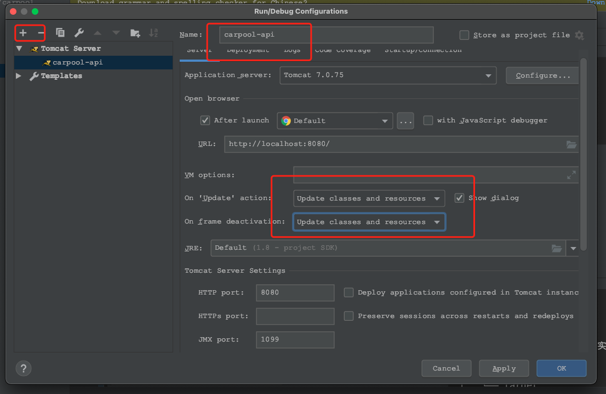

 carpool 拼车程序后台
==========


**carpool**: 是拼车小程序的后台接口项目。

## 项目背景
**carpool-api** 是2018~2109年的时候，微信小程序比较火的时候，想着赶波热度写的一个拼车程序。程序整体的功能包括了拼车模块、圈子模块、车周边模块
和基础支撑模块。 本来想着投入商业运营的，不过正好赶上微信平台对小程序资质审核加强的阶段，所以就搁置了。 项目整体流程没有什么大问题，界面也算比较美
观。 由于项目是个人项目，工作之余，写的也比较匆忙并没有经过严谨的测试，所以想在此基础上二次开发使用的，还需要多测测。

 

## 服务启动
```$xslt
项目要求：
  - JDK1.6 +
  - MYSQL 5.6+
  - TOMCAT7+

```
IDEA 工具 Maven编译项目后

**Local 发布**

 

发布即可

**Linux 服务发布**
```$xslt
mvn package -Pprod
```
上传Tomcat 发布即可，

<span style="color:red;" >注意： 小程序要求https </span>

## 项目结构

```
.
├── LICENSE
├── README.md
├── carpool-api  (功能接口实现)
│   ├── pom.xml
│   ├── src
│   └── target
├── carpool-common （通用的处理）
│   ├── carpool-common.iml
│   ├── pom.xml
│   ├── src
│   └── target
├── carpool.iml
├── doc  （文档脚本）
│   ├── carpool.sql （拼车相关数据脚本）
│   └── sys_region.sql （地域数据脚本）
├── pom.xml
└── tree.md
```

## 关联项目
**carpool-weixin-app**

<a href="https://github.com/songhx/carpool-weixin-app" >[Git地址]</a>

      https://github.com/songhx/carpool-weixin-app

[Gitee地址]


## 后续计划
**carpool-api**这块当时做的比较匆忙，再加上阿里云到期数据库脚本丢失了一版，最近修复了一下，想着先把这版基础版的开源出去，后续做一些升级和经验总结。
不过得看2022年的工作是否有空闲，越来越卷啊，生活不易，且行且珍惜！2022 新的一年先立个Flag吧！

**阶段一：**
* 基础架构升级为微服务；
* 项目提供出一版微服务的管理平台；
* 引入Docker、K8s等'DEVOPS' ；

**阶段二：**
* 基础架构升级为DDD；
* 提供完善的文档支持


# License
[Apache 2.0 License.](LICENSE)